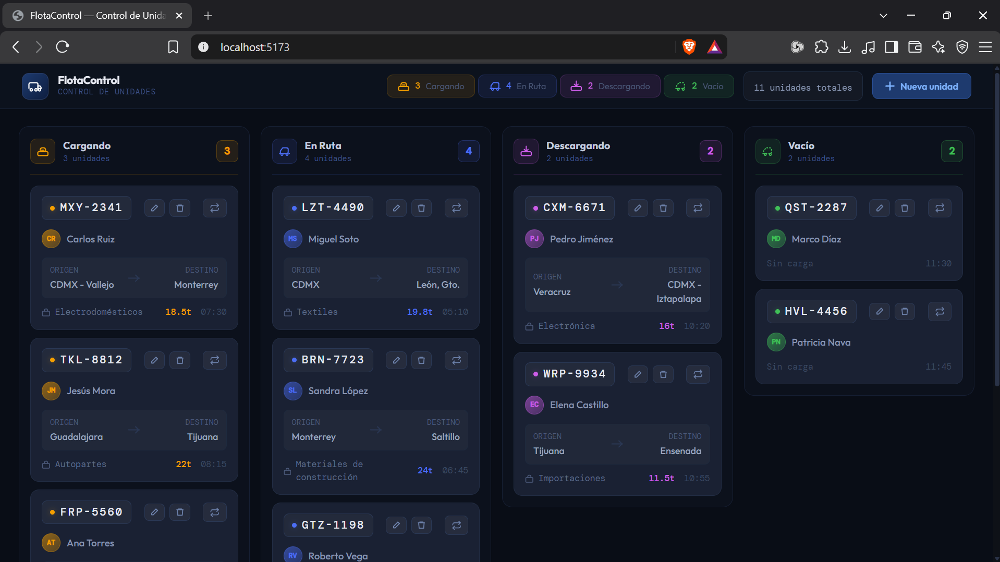

# Tablero Kanban — FlotaControl

Sistema de control de unidades de transporte con tablero Kanban. Permite visualizar, mover y administrar la flota en tiempo real según su estado operativo.



## Descripción

El sistema clasifica las unidades en **4 estados principales**:

| Estado | Descripción |
|--------|-------------|
| **Cargando** | Unidad en proceso de carga |
| **En Ruta** | Unidad en tránsito hacia su destino |
| **Descargando** | Unidad descargando mercancía |
| **Vacío** | Unidad disponible sin carga asignada |

Cada tarjeta muestra información clave: placa, operador, origen, destino, tipo de carga, toneladas y hora.

## Funcionalidades

- Tablero Kanban con 4 columnas de estado
- Arrastrar y soltar unidades entre columnas
- Crear, editar y eliminar unidades
- Mover unidades entre estados desde el menú de cada tarjeta
- Contador de unidades por estado en el encabezado
- Interfaz oscura optimizada para operación logística

## Tecnologías

- [React 19](https://react.dev/)
- [TypeScript](https://www.typescriptlang.org/)
- [Vite 8](https://vite.dev/)
- [Tailwind CSS 4](https://tailwindcss.com/)

## Requisitos

- Node.js 18 o superior
- npm

## Instalación

```bash
# Clonar el repositorio
git clone https://github.com/luis-zaldivar/tablero_kanban.git
cd tablero_kanban

# Instalar dependencias
npm install
```

## Uso

```bash
# Servidor de desarrollo
npm run dev

# Compilar para producción
npm run build

# Vista previa de la build
npm run preview
```

La aplicación se abre en `http://localhost:5173` (o el siguiente puerto disponible).

## Estructura del proyecto

```
tablero_kanban/
├── IMG/                 # Capturas y recursos visuales
├── public/              # Archivos estáticos
├── src/
│   ├── App.tsx          # Componente principal del tablero
│   ├── main.tsx         # Punto de entrada
│   └── index.css        # Estilos globales y tema
├── index.html
├── vite.config.ts
└── package.json
```

## Licencia

Proyecto privado.
